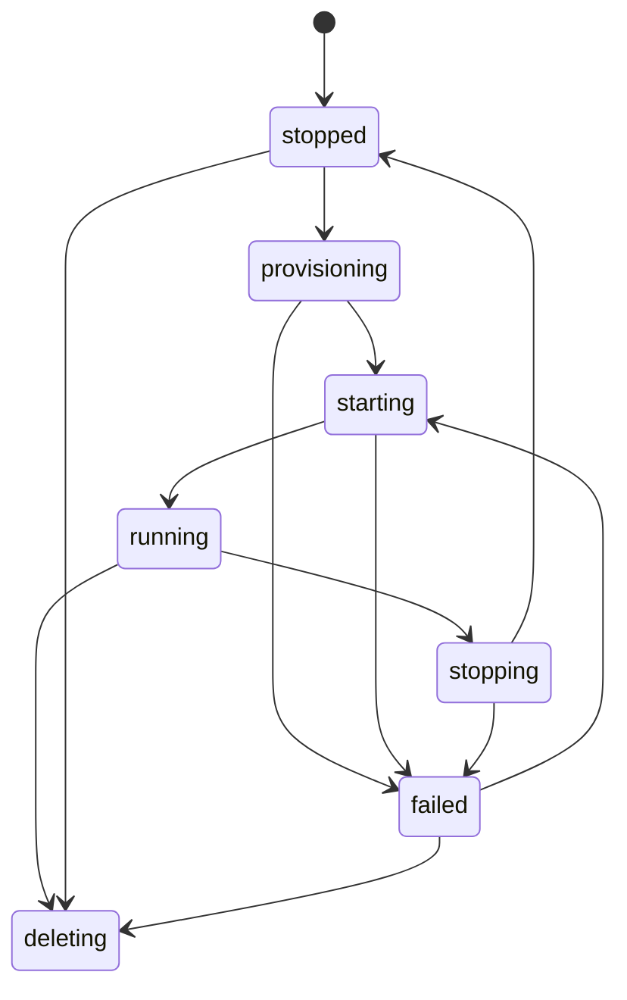

# NetLab Architecture

## System Shape

NetLab is a single-host desired-state control plane. One Go process serves the embedded Vue SPA,
versioned REST/WebSocket APIs, and MCP Streamable HTTP. SQLite WAL stores shared topology, revisions,
tasks, audit events, artifacts, idempotency records, and ordered outbox events. Runtime adapters own
QEMU, Docker, Linux namespaces, bridges, veth/tap devices, cgroups, nftables, consoles, and captures.

```mermaid
flowchart LR
  SPA[Vue SPA] --> API[Gin /api/v1]
  Client[Automation] --> API
  LLM[MCP client] --> MCP[/mcp]
  API --> Commands[Application commands]
  MCP --> Commands
  Commands --> SQLite[(SQLite WAL)]
  SQLite --> Reconcilers[Reconcilers]
  Reconcilers --> QEMU[QEMU/QMP/QGA]
  Reconcilers --> Docker[Docker Engine]
  Reconcilers --> Linux[netns/bridge/nft/cgroup]
  SQLite --> Events[Ordered WebSocket events]
  Events --> SPA
```

## Dependency Rules

- `internal/domain` contains IDs, entities, validation, state machines, and no infrastructure imports.
- `internal/app` contains commands, queries, tasks, audit, artifacts, and reconciliation ports.
- `internal/runtime` implements QEMU, Docker, Linux networking, capture, console, cgroup, and image ports.
- `internal/store/sqlite` implements durable repositories and transactional outbox writes.
- `internal/api` maps HTTP, WebSocket, and MCP contracts to the same application services.
- `web` consumes only documented API contracts; it never reaches SQLite or runtime sockets directly.

## Shared State and Concurrency

Every topology mutation updates durable state before events are published. Resource revisions protect
concurrent writes with `If-Match`. Idempotency records bind a key to a request fingerprint and persisted
response, so equal retries replay and mismatched reuse conflicts. Durable event sequences let clients
resume; expired replay windows require a fresh snapshot.

The task runner persists input, progress, result, errors, cancellation, and timestamps. Queue capacity is
checked before creating a task record, preventing orphaned queued tasks under backpressure.

## Ownership

Every host object has a deterministic NetLab name, label, alias, runtime directory, or nftables comment.
Examples include QEMU launch manifests, Docker labels, `netlab:<resource-id>` interface aliases, cgroup
directories, and nftables rule comments. Cleanup is scoped to those owners. Unknown objects under an
owned runtime root are quarantined instead of deleted.

## Lifecycle



Desired and observed state are separate. Reconcilers inspect actual resources and converge toward
desired state. Partial QMP hot-plug, bridge movement, port mapping, and artifact publication use
compensating cleanup. Errors remain structured and actionable instead of being hidden by retries.

## QEMU and Docker

QEMU launches directly with deterministic QMP, QGA, serial, and VNC Unix sockets. Disk versions are
immutable; nodes use overlays. QMP handles NIC hot-add/remove and event confirmation. QGA guest commands
have timeouts and combined output limits. vCPU count and cgroup `cpu.max` are independent.

Docker containers use API negotiation, `network=none`, ownership labels, immutable image digests, and
normalized CPU/memory limits. Linux links attach container or QEMU interfaces to owned bridges without
restarting nodes.

## Lightweight Networking

PC, L2 switch, and L3 switch nodes use Linux network namespaces. PC configuration supports static
IPv4/IPv6, DHCPv4, DHCPv6, SLAAC, routes, DNS metadata, and diagnostics. L2 switches use namespace
bridges and VLAN membership. L3 switches apply addresses, routes, and forwarding sysctls. Host bridges
and NAT bridges use collision-checked prefixes and owned nftables masquerade rules.

## Diagnostics

Console WebSockets proxy serial or VNC bytes with idle, duration, and bandwidth bounds; disconnecting a
viewer never changes node lifecycle. Capture workers launch dumpcap/tcpdump without shell interpolation,
tee bounded bytes to consumers and optional artifacts, and enforce truncation and retention. Traffic
filters compile validated matches and aggregate packet fingerprints into observed paths.

## Recovery

Control-service restart adoption inspects deterministic owners and preserves running resources. Full host
recovery first applies laboratory policy, then starts QEMU and non-QEMU work with separate concurrency
limits. Each resource reaches a terminal success/failure state; recovery never silently substitutes an
image or deletes an unowned host object.

## Contributor Verification

Write tests with lifecycle changes. Use unit tests for command/QMP construction and validation, contract
tests for OpenAPI/MCP/export schemas, frontend component tests, failure injection, recovery tests, and
privileged integration tests on the acceptance host. The standard sequence is:

```bash
make fmt
make lint
make test
make test-contract
make test-security
make test-integration
make test-recovery
make test-leaks CYCLES=100
make test-web
make build
make test-e2e
```

Skipped privileged tests must state the required host state and remain repeatable. Never add images,
credentials, bootstrap secrets, private keys, or captures as fixtures.
